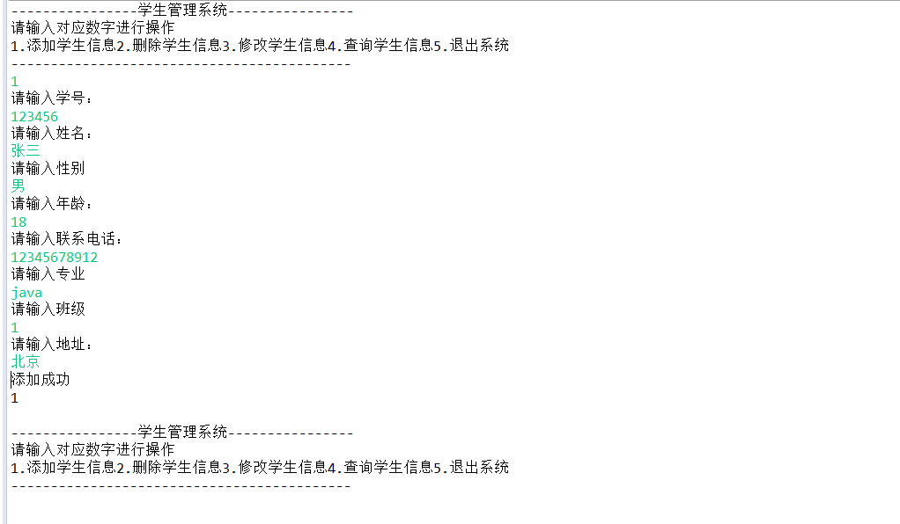

# Java项目——学生信息管理系统

## 一、项目导入

- 本项目使用**eclipse**编写， JDK版本为**java8**
- 导入步骤

**File——>open project from File System...——>Archive**

## 二、运行结果预览

## 三、版权所有

**Copyright © 2021 蓝梦网 All Rights Reserved.**

